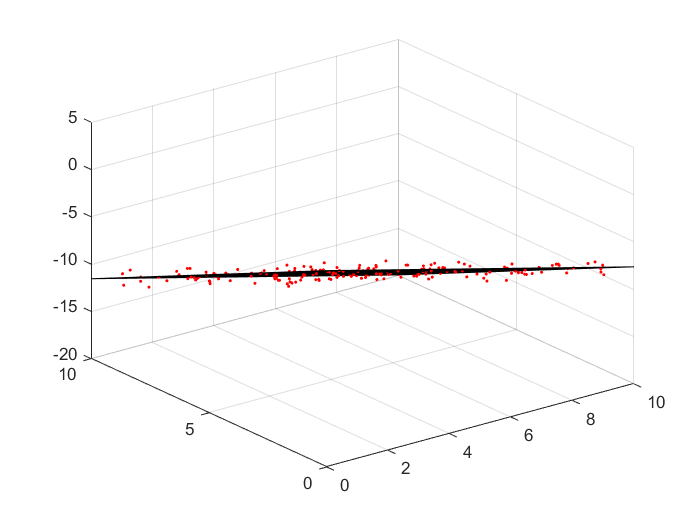
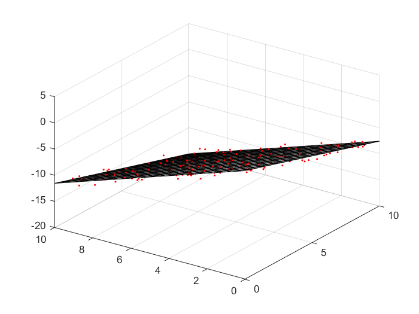

# Plane fit
## Plane fit of 3D points with SVD
* Total least squares minimization

A total least squares problem refers to determining the vector x which minimizes the 2-norm of a vector Ax under the constraint ||x|| = 1. The solution turns out to be the right-singular vector of A corresponding to the smallest singular value.

